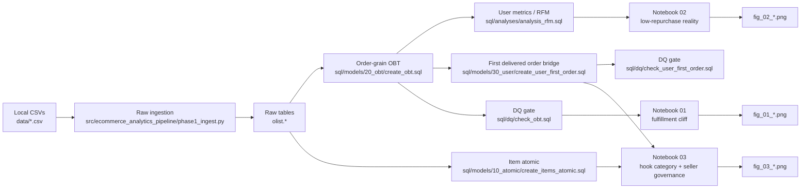

# Olist E-commerce Analytics Pipeline Execution Report

本报告记录本项目的实际实现、可核验证据与最终保留的分析结论，供仓库审阅、项目归档和后续复现参考。

它不是新的 runbook，也不是字段字典；它的角色更接近一份压缩版 execution archive：把 [`README.md`](../README.md) 的主线、[`runbook.md`](runbook.md) 的执行顺序、[`data_dictionary.md`](data_dictionary.md) 的定义边界，以及旧工作文档 [`1.24 项目推进.md`](1.24%20项目推进.md) 里仍然有价值的设计思路，收敛成一条可审计的证据链。

## Overview

本项目最终保留的主线，不是“先讲增长，再找故事”，而是先建立一个可信的 measurement contract，再往下解释业务现象：

- `Metric trust`：先拆清 order / item / user 三层 grain，避免 fan-out、分母漂移和脏数据把结论带偏。
- `Fulfillment cliff`：在 delivered-order 范围内，最稳定的体验损伤信号不是“越早越好”，而是从 `Late_Small` 跨到 `Late_Severe` 时评分显著恶化。
- `Low-repurchase reality`：`90d` 复购必须建立在 `eligible_repurchase_90d=1` 的用户分母上；当前仓库支持的是低复购现实，而不是高频复购平台假设。
- `Action branches`：在这个约束下，首单品类更适合被解释为获客入口筛选，卖家分析更适合被解释为治理优先级排序，而不是直接的因果提升或完美归责。

当前仓库可直接核验的代表性数字包括：

- review coverage `99.33%`
- `delay_days_clipped` vs review：`Pearson=-0.2719`，`Spearman=-0.2999`
- `Late_Small -> Late_Severe` 评分中位数：`4.0 -> 1.0`
- eligible-user `90d` repurchase：`1.30%`
- `monetary_90d` vs `monetary_long`：`163.53` vs `165.20`
- seller-governance queue：`58/611 = 9.5%` sellers in `Bad`, breach-concentration proxy `15.4%`

## Evidence Policy

本报告中的结论遵循以下规则：

- 仅使用当前仓库中可直接核验的主证据：`sql/`、`src/`、`notebooks/*.ipynb` 与 `outputs/figures/*.png`
- 若旧文档 [`1.24 项目推进.md`](1.24%20项目推进.md) 与当前仓库产物冲突，以当前仓库为准
- 对 `DQ` 相关内容，优先表述为“显式门禁 contract 已实现”，而不是假装仓库中已经保存了每次执行的结果快照
- 对 seller / hook / repurchase 相关内容，只保留当前仓库证据真正支持的强度，避免把探索性路径包装成最终结论

## Scope

本报告覆盖以下内容：

1. 为什么项目采用 raw-preserving `ELT`，以及为什么要先建可信指标层
2. 订单级 `OBT`、用户级 `RFM/LTV`、首单桥表与 `DQ` 门禁如何共同构成 measurement contract
3. 三个分析 notebook 各自解决什么问题，以及哪些结论最终被保留
4. 从旧推进文档中，哪些探索被吸收进最终主线，哪些被主动降级或放弃

本报告不覆盖：

- 本地安装、环境变量和命令细节（见 [`runbook.md`](runbook.md)）
- 字段级、主键级和 grain 级定义细节（见 [`data_dictionary.md`](data_dictionary.md)）
- 生产调度、实时监控、线上实验或正式 ROI 归因
- 课堂式代码讲解和统计学教程

## Key Artifacts

- 主入口：[`../README.md`](../README.md)
- 执行路径：[`runbook.md`](runbook.md)
- 指标定义：[`data_dictionary.md`](data_dictionary.md)
- 原始工作文档：[`1.24 项目推进.md`](1.24%20项目推进.md)

- 配置与导入：
  - [`../configs/config.yml`](../configs/config.yml)
  - [`../src/ecommerce_analytics_pipeline/phase1_ingest.py`](../src/ecommerce_analytics_pipeline/phase1_ingest.py)
  - [`../src/ecommerce_analytics_pipeline/ingest.py`](../src/ecommerce_analytics_pipeline/ingest.py)

- SQL 模型与门禁：
  - [`../sql/models/20_obt/create_obt.sql`](../sql/models/20_obt/create_obt.sql)
  - [`../sql/models/10_atomic/create_items_atomic.sql`](../sql/models/10_atomic/create_items_atomic.sql)
  - [`../sql/models/30_user/create_user_first_order.sql`](../sql/models/30_user/create_user_first_order.sql)
  - [`../sql/analyses/analysis_rfm.sql`](../sql/analyses/analysis_rfm.sql)
  - [`../sql/dq/check_obt.sql`](../sql/dq/check_obt.sql)
  - [`../sql/dq/check_user_first_order.sql`](../sql/dq/check_user_first_order.sql)

- 核心 notebook：
  - [`../notebooks/01_obt_feature_analysis.ipynb`](../notebooks/01_obt_feature_analysis.ipynb)
  - [`../notebooks/02_repurchase_diagnosis.ipynb`](../notebooks/02_repurchase_diagnosis.ipynb)
  - [`../notebooks/03_seller_hook_analysis.ipynb`](../notebooks/03_seller_hook_analysis.ipynb)

- 代表性图表：
  - [`../outputs/figures/fig_01_odds_ratio.png`](../outputs/figures/fig_01_odds_ratio.png)
  - [`../outputs/figures/fig_01_roc_curve.png`](../outputs/figures/fig_01_roc_curve.png)
  - [`../outputs/figures/fig_02_ltv90_vs_ltvlong.png`](../outputs/figures/fig_02_ltv90_vs_ltvlong.png)
  - [`../outputs/figures/fig_03_hook_category_matrix.png`](../outputs/figures/fig_03_hook_category_matrix.png)
  - [`../outputs/figures/fig_03_seller_governance_matrix.png`](../outputs/figures/fig_03_seller_governance_matrix.png)
  - [`../outputs/figures/fig_03_roi_sensitivity_heatmap.png`](../outputs/figures/fig_03_roi_sensitivity_heatmap.png)

## Pipeline Sketch

## Key Method Decisions

- `ELT over ETL`
  - 旧推进文档最值得保留的决策，是先完整保留 raw，再在数据库里建模和清洗。当前仓库也明确遵循这条路线：本地 `CSV` 先进入 `olist.*`，后续再由 `SQL models` 构建 `analysis.*`。
  - 这里的 “raw-preserving” 不是模糊口号；当前实现把 8 个 core CSV 作为固定 raw baseline，Phase 1 对缺文件 / 导入失败采用 fail-fast，而不是允许 silent partial load。

- `String-first ingestion`
  - 导入脚本使用 `dtype=str`，避免邮编、ID 之类字段丢失前导零；同时使用 `chunksize=20000` 与 `method="multi"` 保持写入稳定性与吞吐。

- `Order grain first`
  - `items`、`payments`、`reviews` 都先按 `order_id` 聚合，再和订单表连接；这是旧文档里“先聚合，再连接”的核心思想，也是当前仓库最重要的 anti-fan-out 设计。

- `DQ before notebook interpretation`
  - `check_obt.sql` 与 `check_user_first_order.sql` 不是装饰性脚本，而是整个项目的 measurement contract。没有这一层，后面的图和结论都可能只是 join artifact。

- `Delay semantics by layer`
  - 仓库层面保留 signed `delay_days`，忠实记录“提前 / 准时 / 晚到”；但在体验诊断里，notebook 01 会把负值视为对“晚到惩罚”无效的变异，用 `delay_days_clipped` 聚焦 late-delivery penalty。

- `First delivered order + eligible denominator`
  - “首单”在本项目里是首个 delivered order，不是首个下单事件；`90d` 复购只对 `eligible_repurchase_90d=1` 的用户定义，否则数据尾部会被右删失机械压低。

- `Prioritization, not causal overclaim`
  - 首单品类分支被保留为 entry-quality screen；卖家治理分支被保留为 proxy-based review queue。两条动作线都服务于 prioritization，而不是直接的因果 lift 证明。

## Results

### 1) Metric Trust

当前仓库把可信性问题拆成了三层：

- 订单层：`analysis.analysis_orders_obt`
- 商品层：`analysis.analysis_items_atomic`
- 用户层：`analysis.analysis_user_first_order` / `analysis.analysis_user_first_order_categories` / `analysis.analysis_user_metrics`

`DQ` 层面，仓库显式实现了以下检查：

- OBT 行数与 raw delivered orders 对齐
- `gmv` 与 raw payments 汇总一致
- `order_id` 唯一
- `review_score` 域和值逻辑自洽
- `delay_days` 与 `delivery_status` 一致
- 首单表做到 1 user 1 row
- 首单品类桥表做到 `(user_id, category)` 唯一
- 首单 tie-break 与 FK 关系稳定

这一层没有直接产出“漂亮图表”，但它解释了为什么本项目会先讲 grain 和 denominator，再讲分析结论。

### 2) Fulfillment Cliff

当前仓库最强的体验信号来自 notebook 01：

- review coverage：`99.33%`
- `delay_days_clipped` vs review：`Pearson=-0.2719`，`Spearman=-0.2999`
- review-score median：`OnTime=5.0`，`Late_Small=4.0`，`Late_Severe=1.0`
- 标准化数值特征上的差评基线里，`delay_days` 的 `OR=2.2048`
- 当前 `ROC-AUC=0.6987` 仅表示仓库内的 in-sample 描述性基线

这说明仓库真正支持的不是“越早越好”的线性 KPI，而是一个更稳定的断崖解释：

- 轻微延迟还可能保住体验
- 一旦跨进 `Late_Severe`，评分会明显崩塌

因此，当前 repo 更适合被理解为“如何优先避免恶化”，而不是“如何持续追求更早送达”。

### 3) Low-Repurchase Reality

notebook 02 和 `analysis_rfm.sql` 一起支持了当前项目最关键的业务约束：

- 只有 `eligible_repurchase_90d=1` 的用户，才进入 `90d` 复购分母
- 在这个分母上，eligible-user `90d` repurchase rate = `1.30%`
- `monetary_90d` 与 `monetary_long` 均值接近：`163.53` vs `165.20`

这意味着：

- 这个样本更像低频、低复购 marketplace，而不是高频复购平台
- 从旧推进文档里延伸出来的很多“强 retention 故事”，在当前仓库里都被主动降级了
- 项目的后续动作，不应该默认建立在“用户会高频回来”这个前提上

### 4) Hook Category Screen

在低复购现实下，当前仓库保留了一个仍然有用的动作分支：用首单品类做 entry-quality screen。

当前可直接核验的结果包括：

- baseline：eligible-user `90d` repurchase = `1.30%`
- above-baseline examples：
  - `fashion_bags_accessories`: `2.50%` (`36/1442`)
  - `bed_bath_table`: `2.00%` (`144/7183`)
  - `sports_leisure`: `1.65%` (`100/6070`)
  - `furniture_decor`: `1.56%` (`79/5054`)

但这里的解释边界也很清楚：

- 首单定义是 first delivered order
- 同一用户的首单篮子可能映射到多个品类，cohort 会重叠
- `acquisition_users > 500` 只是 notebook 内的 heuristic threshold
- 因此它更像获客入口筛选候选，而不是 category-level causal lift

### 5) Seller Governance Queue

旧推进文档里关于供给侧的最好部分，是“不要把所有晚到都直接怪给卖家”。当前仓库把这点保留成了一套更克制的治理逻辑：

- 用 `shipping_limit_date` vs `carrier_date` 构造 seller-side SLA breach proxy
- 聚合到 seller 粒度得到 `order_volume`、`sla_breach_rate`、`price` exposure proxy
- 用 `seller_state` 平均违约率做 state-relative calibration
- 用 `performance_gap > 5pp`、`order_volume > 30`、`price` 中位数分层，构建治理矩阵

当前 repo-visible 结果：

- active sellers：`611`
- `Bad` bucket：`58/611 = 9.5%`
- breach-concentration proxy：`15.4%`
- price-weighted exposure proxy：`263,811.44`
- `Bad` bucket average breach rate：`29.6%`

这条分支真正提供的是一个更窄的 review queue，而不是一个“谁该被处罚”的真值标签。

## What Changed During Exploration

被保留的部分：

- ELT 而不是 ETL
- 先建 OBT 和 DQ，再讲分析
- fan-out / denominator / tie-break 的防御性设计
- 不把总 late 直接等同于卖家责任

被降级或放弃的部分：

- `Repurchase-first` 主叙事：因为当前 repo 证据显示 `90d` 复购仅 `1.30%`
- 强因果表述：尤其是“延迟是复购流失独立致因”这类说法，当前仓库不再保留
- SKU 级“高复购商品”定义：对 Olist 这类低频耐用品平台样本过稀，最终被更稳健的 first-order category screen 替代
- “卖家毒瘤 / 清洗 / 清退”这类强惩罚语言：当前仓库改为 governance prioritization

本报告因此选择把最终保留的执行路径压缩为一条 end-to-end narrative，而不是把探索过程拆成多份阶段文档。

## Interpretation Boundaries

- 当前 `OBT` 只覆盖 delivered orders，因此“首单”在本仓库里指 first delivered order。
- notebook 02 的 delay mean-gap / T-test 只能算 supplementary signal，不应被讲成 repurchase causality proof。
- hook categories 是 entry screening candidates，不是品类层面的 lift 证明。
- seller-side SLA breach 只是 proxy，不是完整 fault tree。
- seller 分层中的 `price` 是 item-price exposure proxy，不是 audited `GMV`、损失或已实现财务回报。
- notebook 01 的 `ROC-AUC=0.6987` 是 in-sample descriptive baseline，不应直接当成可上线性能。
- 当前仓库是 batch analytics case，而不是实时预警系统或上线运营系统。

## Verify in 5 Minutes

如果只花 5 分钟，建议按这个顺序检查：

1. 打开 [`../README.md`](../README.md)
   - 先确认主线是否是 `metric trust -> fulfillment cliff -> low-repurchase reality -> action branches`

2. 打开 [`../sql/dq/check_obt.sql`](../sql/dq/check_obt.sql) 和 [`../sql/dq/check_user_first_order.sql`](../sql/dq/check_user_first_order.sql)
   - 确认 repo 确实把 grain、金额、唯一性和桥表稳定性做成了显式门禁

3. 打开 [`../notebooks/01_obt_feature_analysis.ipynb`](../notebooks/01_obt_feature_analysis.ipynb)
   - 看 review coverage、Pearson / Spearman、`Late_Small -> Late_Severe` 中位数
   - 再看 [`../outputs/figures/fig_01_odds_ratio.png`](../outputs/figures/fig_01_odds_ratio.png) 和 [`../outputs/figures/fig_01_roc_curve.png`](../outputs/figures/fig_01_roc_curve.png)

4. 打开 [`../notebooks/02_repurchase_diagnosis.ipynb`](../notebooks/02_repurchase_diagnosis.ipynb)
   - 看 `eligible_repurchase_90d`、`90d` 复购率和 `monetary_90d` / `monetary_long`
   - 再看 [`../outputs/figures/fig_02_ltv90_vs_ltvlong.png`](../outputs/figures/fig_02_ltv90_vs_ltvlong.png)

5. 打开 [`../notebooks/03_seller_hook_analysis.ipynb`](../notebooks/03_seller_hook_analysis.ipynb)
   - 看首单品类筛选候选、seller governance matrix、risk exposure sensitivity
   - 再看 [`../outputs/figures/fig_03_hook_category_matrix.png`](../outputs/figures/fig_03_hook_category_matrix.png)、[`../outputs/figures/fig_03_seller_governance_matrix.png`](../outputs/figures/fig_03_seller_governance_matrix.png)、[`../outputs/figures/fig_03_roi_sensitivity_heatmap.png`](../outputs/figures/fig_03_roi_sensitivity_heatmap.png)

## Relationship to Other Docs

- [`../README.md`](../README.md)：负责告诉读者“这个项目最后在讲什么”
- [`runbook.md`](runbook.md)：负责告诉读者“如何复现这条链路”
- [`data_dictionary.md`](data_dictionary.md)：负责告诉读者“每个指标、表和分母到底是什么意思”
- 本报告：负责告诉读者“这条链路为什么会长成现在这样，以及哪些探索被保留、哪些被主动放弃”
